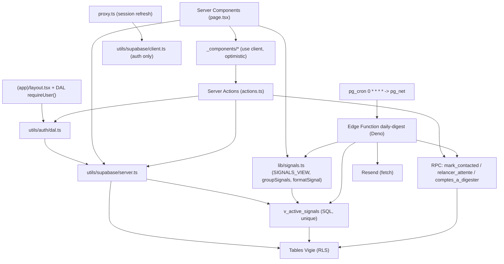
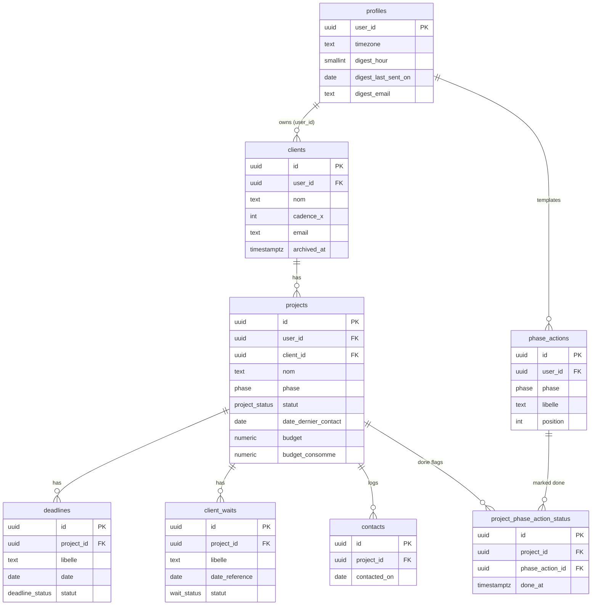

# Architecture Spine — Vigie

## Design Paradigm

**Server-first Next.js App Router sur Supabase.** Les **lectures** se font dans des Server Components qui lisent Postgres directement, la **RLS** (`auth.uid() = user_id`) étant la frontière de sécurité. Les **écritures** passent exclusivement par des Server Actions co-localisées. Les **4 signaux de danger** sont **dérivés à la lecture** par une **vue SQL unique** (`v_active_signals`) consommée à l'identique par le cockpit (web) et par le digest (Edge Function planifiée) — c'est ce qui empêche structurellement l'écran et l'e-mail de diverger. Mono-utilisateur, mono-tenant logique garanti par la RLS.

**Mapping en dossiers :** `app/(app)/` = route-group protégé (toute l'app métier), chaque dossier de route portant `page.tsx` (Server Component, lecture) + `actions.ts` (`'use server'`, écriture) + `_components/` (wrappers client optimistes). `app/login` + `app/auth/callback` = public. `utils/supabase/{server,client}.ts` = accès DB (serveur = lecture/écriture RLS ; client = `auth` seul). `utils/auth/dal.ts` = frontière `requireUser()`. `lib/signals.ts` = `SIGNALS_VIEW` + `groupSignals()` + `formatSignal()` partagés cockpit/digest. `supabase/schema.vigie.sql` = DDL canonique. `supabase/functions/daily-digest/` = Edge Function du digest. `proxy.ts` (racine) = refresh de session.

## Invariants & Rules

> Tags : `[ADOPTED]` = déjà fixé par la réalité existante (scaffold/blueprint).

### AD-1 — Server-first : lectures = Server Components, écritures = Server Actions, zéro écriture métier côté client `[ADOPTED]`
- **Binds :** toutes les surfaces UI (cockpit, /projets, /clients, /reglages, fiches), tout builder ajoutant route/lecture/mutation, l'auth, le quick-add.
- **Prevents :** la dispersion de la logique métier (reset cadence niveau projet, repositionnement `date_reference`, log contact, calcul phase) dans des Client Components — ce qui ferait diverger cockpit/digest et rendrait l'audit impossible ; et qu'un Client Component importe `utils/supabase/client.ts` pour écrire des données métier.
- **Rule :** toute lecture de données Vigie se fait dans un Server Component via `utils/supabase/server.ts` (`createClient` async). Toute ÉCRITURE passe par une Server Action `'use server'` co-localisée sous `app/(app)/**/actions.ts`. `utils/supabase/client.ts` (browser, publishable key) ne sert QU'À `supabase.auth` sur `/login`. Aucun composant client ne recalcule un signal ; le client ne fait que du retrait optimiste (`useOptimistic`) en attendant la revalidation. Chaque Server Action, dans l'ordre : (1) `requireUser()` du DAL ; (2) écriture via le client serveur en laissant la RLS filtrer (jamais passer `user_id` à la main, jamais la clé secrète côté app) ; (3) `revalidatePath` ciblé (au minimum `/` pour toute mutation touchant un signal cockpit). Pas de `revalidateTag` (signature 2-args sous Next 16) ; `cacheComponents` reste OFF (les pages lisent `cookies()` → déjà dynamiques).

### AD-2 — Isolation RLS mono-utilisateur : `auth.uid()=user_id` sur toute table métier `[ADOPTED]`
- **Binds :** les 8 tables Vigie (profiles, clients, projects, deadlines, client_waits, phase_actions, project_phase_action_status, contacts), la vue `v_active_signals`, toute table/vue future.
- **Prevents :** toute fuite cross-tenant si l'app devenait multi-compte ; rattrape côté DB toute requête app oubliant le filtre `user_id` ; l'exposition de la clé secrète côté client.
- **Rule :** toute table métier porte `user_id uuid not null default auth.uid() references auth.users(id) on delete cascade`, a RLS activée, et expose exactement 4 policies `(select auth.uid()) = user_id` (SELECT/INSERT/UPDATE/DELETE, rôle `authenticated`). Aucun accès `anon`. La clé `sb_secret_*` (service role) ne quitte JAMAIS le serveur (cron/Edge Function) ; côté client/app uniquement la `sb_publishable_*` (`NEXT_PUBLIC_SUPABASE_ANON_KEY`). La table démo `todos` et ses policies anon publiques sont supprimées.

### AD-3 — Signaux dérivés à la lecture, définition UNIQUE dans la vue gelée `public.v_active_signals`
- **Binds :** FR-6/7/4/9 (les 4 signaux), FR-10 (cockpit), FR-11 (actions rapides), FR-12 (digest). Cockpit Server Component, Edge Function digest. Entités projects/clients/deadlines/client_waits/phase_actions/project_phase_action_status.
- **Prevents :** la divergence cockpit↔digest (risque produit n°1 de FR-12) ; qu'un builder réimplémente un seuil en dur (coder 7 au lieu de `cadence_x`, ajouter un délai de grâce sur phase) ; les vues parallèles (v_cockpit, v_signal_*) qui dériveraient — le nom est gelé.
- **Rule :** il existe UNE SEULE vue de signaux : `public.v_active_signals` (`security_invoker=true`), dans le fichier schema canonique. Aucune autre vue/sous-vue de signal ; aucun calcul de seuil en TypeScript. La vue retourne des lignes PLATES, une par signal actif : `(user_id, project_id, client_id, signal text, ref_id uuid, palier text['depassee'|'jour_j'|'j_1'|'j_3'|null], age_days int, cadence_x int, libelle_metier text, urgency_rank int)`. Pas de label de présentation pré-rédigé ni de jsonb agrégé. Tout consommateur l'importe via `lib/signals.ts: SIGNALS_VIEW = 'v_active_signals'`. Le périmètre projet-vivant (`statut='actif' AND clients.archived_at IS NULL`) est défini EXACTEMENT une fois, dans le CTE `live`. Le budget n'y figure JAMAIS.

### AD-4 — Forme et contrats gelés de `v_active_signals` : lignes plates, `ref_id` uuid, `urgency_rank` unique, agrégation côté app
- **Binds :** le builder cockpit (FR-10, regroupe par `project_id`), le builder actions rapides (FR-11, route par `signal`+`ref_id`), le builder digest, les types Supabase générés.
- **Prevents :** le mismatch de forme (jsonb agrégé en SQL vs lignes plates) ; le mismatch de clé (`ref_id` bigint vs uuid → mutation qui touche 0 ligne sans erreur, casse FR-11) ; les barèmes de tri rivaux qui trieraient différemment les mêmes signaux entre cockpit et digest.
- **Rule :** la vue reste PLATE (1 ligne/signal) ; l'agrégation par projet + le tri se font côté app dans UNE fonction partagée `groupSignals(rows)` consommée à l'identique par cockpit ET digest. Tous les ids Vigie sont uuid : `ref_id` est uuid, aucun id n'est typé `number` côté app — tous dérivent des types générés (`supabase gen types typescript`). Le tri d'urgence est porté par la SEULE colonne `urgency_rank` (plus grand = plus urgent), encodant le défaut PRD §9 : échéance dépassée (`1000 + jours de retard`) > jour J (800) > J-1 (700) > J-3 (600) > silence (500) > attente (400) > phase (300) ; tie-break `age_days DESC NULLS LAST` (la phase porte `age_days=0`). Aucun consommateur ne réordonne. La présentation textuelle est rendue par `formatSignal(row)` TS partagé (cockpit + email), jamais en SQL.

### AD-5 — Sémantique du temps : `today_local = (now() AT TIME ZONE profiles.timezone)::date`, jamais `current_date`
- **Binds :** la vue `v_active_signals` (CTE live), le RPC de sélection du digest, l'idempotence (`digest_last_sent_on`), tout calcul de seuil.
- **Prevents :** la divergence silencieuse cockpit↔digest à la frontière de minuit (le cron envoie à 08:00 LOCAL et calcule l'idempotence en date locale ; la vue qu'il lit doit calculer « aujourd'hui » dans le même fuseau, sinon entre minuit et ~02:00 Paris un palier bascule avec un jour de décalage).
- **Rule :** aucun signal n'utilise `current_date`. Le CTE `live` JOINT `profiles` et matérialise `today_local` une seule fois ; tous les seuils l'utilisent (silence `today_local - date_dernier_contact > cadence_x` STRICT ; échéance `date <= today_local + 3` avec paliers sur `today_local` ; attente `today_local - date_reference > cadence_x` STRICT — MÊME colonne `cadence_x` que silence). Le fuseau ne vit QUE dans `profiles.timezone` (nom IANA, jamais un offset). Le RPC du digest et le claim d'idempotence utilisent la MÊME expression. Les seuils sont STRICTS (`>`) conformes FR-4/FR-7.

### AD-6 — Actions multi-tables encapsulées dans un RPC Postgres transactionnel unique
- **Binds :** « J'ai contacté » (FR-5), « Relancé » (FR-4), toute action future touchant >1 table.
- **Prevents :** les deux écritures non atomiques de « J'ai contacté » (insert `contacts` + update `projects.date_dernier_contact`) faites séparément → date mise à jour sans ligne d'audit (casse FR-5) ou inverse ; deux chemins de mutation rivaux pour la même action.
- **Rule :** toute action métier touchant >1 table passe par UN RPC Postgres unique (security invoker, RLS s'applique) appelé via `supabase.rpc()`, jamais par 2 appels `.update()/.insert()` séparés. « J'ai contacté » = `mark_contacted(p_project_id uuid)` (insert contacts + update `date_dernier_contact = today_local`, une transaction). « Relancé » = `relancer_attente(p_wait_id uuid)` (`date_reference=today_local`, `statut='relancee'`). Les actions mono-table (marquer échéance/action de phase faite) restent de simples écritures en Server Action.

### AD-7 — Provisioning du compte : trigger DB `on auth.users` crée `profiles` + seed `phase_actions` par défaut
- **Binds :** le flux signup/login, `profiles` (1 ligne), `phase_actions` (template), le signal « action de phase oubliée » (FR-9), FR-8.
- **Prevents :** que le 4e signal soit silencieusement mort (sans template seedé, le `NOT EXISTS` de la vue ne remonte jamais rien et tous les tests CRUD passent quand même) ; le « OU » non tranché (migration vs Server Action) où personne n'implémente le seed ; l'absence de ligne `profiles`.
- **Rule :** un trigger Postgres `on auth.users insert` exécute `handle_new_user()` (security definer) qui (a) insère la ligne `profiles` (timezone `Europe/Paris`, `digest_hour 8`), (b) seede les `phase_actions` par défaut (au minimum : tests→« organiser les tests » ; livraison→« livrer », « poser un délai de retour »). Le seed ne matérialise QUE le template, jamais des statuts « pas fait » (absence = non fait). Test d'acceptation : après signup, `count(phase_actions)>0` et un projet neuf en phase `livraison` fait remonter ≥1 signal phase. Le seed n'est JAMAIS laissé à une Server Action côté app.

### AD-8 — Digest : pg_cron horaire UTC → Edge Function `daily-digest` → Resend, source = `v_active_signals`, idempotence par claim optimiste
- **Binds :** FR-12, l'Edge Function `supabase/functions/daily-digest`, la migration pg_cron+pg_net, `profiles` (timezone, digest_hour, digest_last_sent_on, digest_email), Resend, la vue `v_active_signals`, `formatSignal/groupSignals`.
- **Prevents :** un scheduler incompatible avec « 08:00 fuseau du compte » (Vercel Hobby 1/jour ±59 min), le double-envoi (pg_net fire-and-forget), les mails vides (FR-12), la fuite de secret côté client, la duplication de la logique des 4 signaux.
- **Rule :** UN job pg_cron `0 * * * *` (UTC) appelle via pg_net (`net.http_post`) l'Edge Function `daily-digest`, avec un secret partagé en header (401 sinon). L'Edge Function lit avec `sb_secret_*` (service role, bypass RLS → filtre EXPLICITE `.eq('user_id',uid)`) et est déployée `--no-verify-jwt`. Un RPC `comptes_a_digester()` renvoie les users où `date_part('hour', now() at time zone timezone)::int = digest_hour AND digest_last_sent_on is distinct from (now() at time zone timezone)::date`, avec `local_today` et `digest_email` (fallback `auth.users.email`). Pour chaque user : lire `v_active_signals` (`.eq('user_id',uid)`), `groupSignals`, `formatSignal` ; si 0 ligne → PAS d'envoi. Idempotence par CLAIM OPTIMISTE : `update profiles set digest_last_sent_on=local_today where user_id=uid and digest_last_sent_on is distinct from local_today returning *` ; si 0 ligne → skip ; envoyer Resend ; si échec → remettre l'ancienne valeur (pas null) et journaliser sans bloquer. Colonne d'idempotence : `profiles.digest_last_sent_on` (un seul nom).

### AD-9 — Transport email : Resend en `fetch` brut depuis l'Edge Function, secrets côté serveur, template inline-CSS mail-safe
- **Binds :** FR-12, l'Edge Function `daily-digest`, `RESEND_API_KEY` + `APP_BASE_URL` (Edge secrets), le template, les liens profonds.
- **Prevents :** la fuite de la clé Resend côté client (piège `NEXT_PUBLIC_`), les mails cassés/spam (CSS non mail-safe, pas de SPF/DKIM), les liens profonds relatifs cassés, la contamination du digest par le budget.
- **Rule :** le digest part EXCLUSIVEMENT de l'Edge Function `daily-digest`, appelant Resend via `fetch` brut (zéro dépendance npm). `RESEND_API_KEY` et `APP_BASE_URL` sont lus via `Deno.env.get` depuis les Edge Function Secrets — INTERDIT de les nommer `NEXT_PUBLIC_*` ou de les placer côté Next. Template = tables + inline-CSS mail-safe (pas de flexbox/grid/`<style>` externe/webfont), une section par type de signal trié par `urgency_rank`, badge = pastille teintée + LIBELLE TEXTE (couleur jamais seul porteur de sens : Silence/Échéance/Attente/Phase), chaque ligne = lien profond ABSOLU `${APP_BASE_URL}/projets/<project_id>`. Un projet multi-signaux apparaît une fois par section concernée. Le budget n'apparaît JAMAIS. Ton non culpabilisant (Voice EXPERIENCE) via `formatSignal` partagé. Prérequis prod (hors code) : vérifier le domaine d'envoi chez Resend (SPF+DKIM+DMARC).

### AD-10 — Auth mono-utilisateur : route-group `(app)` gardé par DAL `requireUser()`, `proxy.ts` (pas `middleware.ts`) refresh-only, signup désactivé `[ADOPTED]`
- **Binds :** toutes les routes protégées, `/login`, `/auth/callback`, le proxy de session, l'epic auth.
- **Prevents :** la dette `middleware.ts` (déprécié Next 16) et les sessions Supabase jamais rafraîchies ; le faux sentiment de sécurité d'un check proxy non doublé par le DAL (un POST direct sur une Server Action contourne le proxy) ; qu'un tiers crée son propre espace RLS-isolé.
- **Rule :** toute l'app protégée vit dans `app/(app)/` dont le layout serveur appelle `requireUser()` (DAL `utils/auth/dal.ts`, React `cache()`, fait `supabase.auth.getUser()` + `redirect('/login')`) AVANT tout rendu. Le DAL est la VRAIE frontière d'auth, re-vérifiée dans CHAQUE Server Action — jamais se fier au proxy seul. Le refresh de session vit dans `proxy.ts` à la RACINE (export `proxy` + `config.matcher`, runtime Node, pattern cookie `getAll/setAll` de @supabase/ssr 0.12), qui rafraîchit la session et redirige mais ne lit JAMAIS la DB. Le matcher COUVRE `/` et toutes les routes incl. les POST des Server Actions. Le signup public est DÉSACTIVÉ (1 seul user seedé : alex.grasseels@gmail.com) ; `signInWithPassword` côté client est l'unique exception « auth » à l'invariant d'écriture.

### AD-11 — Enveloppe opérationnelle : un seul fichier schema canonique, déploiement Vercel (app) + Supabase (DB/cron/Edge/secrets)
- **Binds :** le fichier schema SQL, tous les builders exécutant du DDL, le déploiement app et digest, les secrets et environnements.
- **Prevents :** les deux schemas rivaux (`schema.sql` todos vs `schema.vigie.sql`) où des builders appliquent le DDL au mauvais fichier ou recréent un modèle divergent (noms français vs anglais) ; la confusion sur où vivent les secrets et qui déclenche le cron.
- **Rule :** UN SEUL fichier schema source de vérité : `supabase/schema.vigie.sql` (corrigé par AD-3/4/5/6/7) ; `supabase/schema.sql` (démo todos) est supprimé après consolidation. Les tables Vigie sont en ANGLAIS pluriel (clients, projects, deadlines, client_waits, phase_actions, project_phase_action_status, contacts, profiles) ; les noms français singuliers sont de la prose, jamais des identifiants SQL. L'app Next déploie sur Vercel (`cacheComponents` OFF, Turbopack par défaut). DB, job pg_cron, Edge Function et secrets vivent dans Supabase : `sb_secret_*` + `DIGEST_INVOKE_SECRET` + `RESEND_API_KEY` + `APP_BASE_URL` en Edge/Vault, jamais côté Next. Extensions DB : `pg_cron`, `pg_net`, `supabase_vault`. Les types TS sont générés via `supabase gen types typescript` et commités.

### Directions de dépendance autorisées



## Consistency Conventions

| Concern | Convention |
| --- | --- |
| Fichier schema canonique | UN seul : `supabase/schema.vigie.sql`. `supabase/schema.sql` (démo todos) supprimé. Tout DDL Vigie y vit ; aucune table/vue ailleurs. |
| Nommage SQL | Tables en anglais pluriel (clients, projects, deadlines, client_waits, phase_actions, project_phase_action_status, contacts, profiles). Vue gelée : `public.v_active_signals`. |
| Accès à la vue de signaux | Toujours via `SIGNALS_VIEW` de `lib/signals.ts`. Cockpit lit en session (RLS). Digest lit en service_role avec `.eq('user_id',uid)` explicite. |
| Calcul du temps | `today_local = (now() AT TIME ZONE profiles.timezone)::date` partout. `current_date` interdit dans tout calcul de signal/idempotence. Seuils silence/attente STRICTS (`>`). |
| Types | `supabase gen types typescript`, commité. Aucun id typé `number` côté app ; tous les ids sont uuid dérivés des types générés. |
| Mutation | Écriture = Server Action sous `app/(app)/**/actions.ts`. Multi-tables → RPC Postgres transactionnel (`mark_contacted`, `relancer_attente`). Chaque action : `requireUser()` → écriture RLS → `revalidatePath` ciblé (min `/`). |
| Clé Supabase | `sb_publishable_*` côté client (`NEXT_PUBLIC_SUPABASE_ANON_KEY`), `sb_secret_*` serveur uniquement (Edge/cron). Edge Function déployée `--no-verify-jwt`. |
| Refresh session | `proxy.ts` à la racine (PAS `middleware.ts`), runtime Node, pattern `getAll/setAll` @supabase/ssr 0.12. DAL `requireUser()` re-vérifie dans chaque action. |
| Présentation des signaux | Données brutes en SQL ; texte rendu par `formatSignal(row)` TS partagé cockpit+email. Tri par la seule colonne `urgency_rank`. |
| Caching | `cacheComponents` OFF en v1. Pages dynamiques via `cookies()`. Revalidation post-mutation = `revalidatePath` ciblé (jamais `revalidateTag`). |

## Stack

| Name | Version |
| --- | --- |
| Next.js | 16.2.9 |
| React / react-dom | 19.2.4 |
| TypeScript | ^5 |
| Tailwind CSS | ^4 |
| @supabase/ssr | ^0.12.0 |
| @supabase/supabase-js | ^2.108.2 |
| Supabase Postgres + Auth (RLS, pg_cron, pg_net, supabase_vault) | plateforme |
| Supabase Edge Functions (Deno) | runtime |
| Resend (transport email, fetch brut) | free tier |
| Vercel (hébergement app Next) | plateforme |

## Structural Seed

### Modèle d'entités



### Arbre source (cold-start ; le code possède le détail ensuite)

```text
app/
  layout.tsx                       # racine: <html>, fonts, metadata "Vigie". Aucun appel Supabase.
  login/page.tsx                   # Client: supabase.auth.signInWithPassword (auth only). Public.
  auth/callback/route.ts           # GET: exchangeCodeForSession -> redirect('/').
  (app)/                           # route-group protégé (segment () = pas d'URL)
    layout.tsx                     # Server: requireUser() (DAL) AVANT tout. Coquille + QuickAddBar + Toaster.
    page.tsx                       # COCKPIT '/': lit v_active_signals via lib/signals -> groupSignals; KPI counts.
    actions.ts                     # jaiContacte(rpc mark_contacted), relancer(rpc), marquerEcheanceFaite, marquerActionPhaseFaite, quickAdd. -> requireUser + revalidatePath('/').
    _components/                    # cockpit-list, quick-add-bar, kpi-card, toaster (use client, optimistic)
    projets/page.tsx + actions.ts  # liste + creerProjet/editerProjet/clorProjet/changerPhase
    projets/[id]/page.tsx          # FICHE: champs, KPI budget (lecture, informatif), échéances, attentes, actions de phase, "J'ai contacté"
    projets/[id]/actions.ts        # échéances/attentes/budget/notes/jaiContacte
    clients/page.tsx + actions.ts  # liste + creerClient/editerClient/archiverClient
    clients/[id]/page.tsx          # FICHE client + projets rattachés
    reglages/page.tsx + actions.ts # phase_actions éditables, digest_hour, timezone IANA
utils/
  supabase/server.ts               # EXISTANT (async, getAll/setAll). lecture/écriture RLS.
  supabase/client.ts               # EXISTANT (publishable). AUTH UNIQUEMENT.
  auth/dal.ts                      # NOUVEAU: requireUser() = getUser() | redirect('/login'), React cache().
lib/
  signals.ts                       # SIGNALS_VIEW='v_active_signals'; groupSignals(rows); formatSignal(row). Partagé cockpit+digest.
proxy.ts                           # RACINE (PAS middleware.ts). Refresh session + redirect. Node runtime.
supabase/
  schema.vigie.sql                 # DDL CANONIQUE: 8 tables + RLS + v_active_signals (today_local, urgency_rank, plat) + RPC + trigger handle_new_user. schema.sql todos supprimé.
  functions/daily-digest/index.ts  # Edge (Deno): RPC comptes_a_digester -> v_active_signals -> formatSignal -> Resend. Claim idempotent. Deploy --no-verify-jwt.
  migrations/xxxx_digest_cron.sql  # pg_cron 0 * * * * -> pg_net POST daily-digest; secrets Vault.
.env.local                         # NEXT_PUBLIC_SUPABASE_URL + ANON_KEY (=sb_publishable_). Jamais sb_secret_ ici.
```

## Capability → Architecture Map

| Capability / Area | Lives in | Governed by |
| --- | --- | --- |
| Saisie & modèle de suivi (FR-1..FR-5) : CRUD clients/projets/échéances/attentes + « J'ai contacté » | `app/(app)/{clients,projets}/**`, fiches `[id]/page.tsx`, quick-add-bar | AD-1, AD-2, AD-6 |
| Moteur d'échéances J-3/J-1/J0/dépassée (FR-6) : dernier palier franchi | `v_active_signals` (CTE échéance, paliers sur `today_local`) | AD-3, AD-4, AD-5 |
| Moteur de cadence / Silence trop long (FR-7) | `v_active_signals` (CTE silence), `projects.date_dernier_contact` | AD-3, AD-5, AD-6 |
| Conscience de phase / Action de phase oubliée (FR-8, FR-9) | `phase_actions` + `project_phase_action_status` + `v_active_signals` (NOT EXISTS) ; édition dans `/reglages` | AD-3, AD-7 |
| Cockpit de triage + actions rapides (FR-10, FR-11) | `app/(app)/page.tsx` + cockpit-list + actions.ts ; `lib/signals` | AD-1, AD-3, AD-4, AD-6 |
| Digest e-mail quotidien (FR-12) | `supabase/functions/daily-digest` + migrations pg_cron ; `profiles` | AD-8, AD-9, AD-5, AD-3 |

## Deferred

- **Fuseaux à offset 30/45 min** (Asia/Kolkata, Nepal) — le cron horaire `0 * * * *` ne tombe pas pile sur l'heure locale. Sans objet pour l'unique compte Europe/Paris ; passer à `0,30 * * * *` si un tel compte est ajouté.
- **`distinct-on` échéance la plus urgente par projet** — la vue émet une ligne par échéance `a_venir`. `groupSignals` affiche des badges multiples (conforme FR-10) et l'urgence projet = `max(urgency_rank)`. Affiner si l'UI juge confus deux badges échéance ; non bloquant.
- **Soft-delete de compte / sauvegarde avant `ON DELETE CASCADE`** depuis `auth.users` — supprimer l'user efface tout le compte (voulu en mono-user). À confirmer avant prod.
- **CHECK croisé `budget_consomme > budget`** — le % >100% est un cas réel et informatif (seuil EXPERIENCE 90%). Aucun CHECK volontairement ; comportement souhaité confirmé.
- **Cron de réconciliation J+1** si crash entre claim idempotent et envoi Resend — risque faible mono-user ; filet de réconciliation différé.
- **DNS du domaine d'envoi Resend (SPF/DKIM/DMARC)** — étape hors-code obligatoire avant prod pour la délivrabilité ; sans elle le digest part en spam.
- **Surveillance `net._http_response`** (pg_net fire-and-forget) — pas de retry fiable ; un POST cron raté est rattrapé au tick horaire suivant. Monitoring léger différé.
